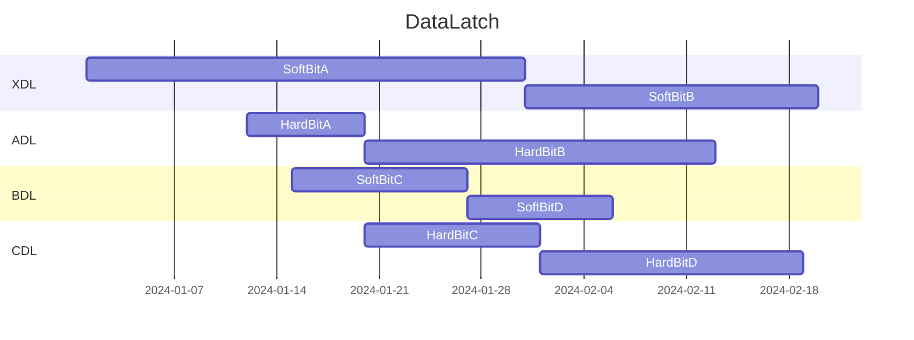

## How to Use
**T Horisawa**
MarkDown用VSCode拡張機能
・MarkDown All in One
・Markdown Preview Enhanced


```wavedrom
{ signal: [
  {                              node: '...Z..Y', phase:0.14},
  { name: 'A', wave: '01..0..',  node: '.a..e..' },
  { name: 'clk', wave: 'lhNhplP' },
  { name: 'B', wave: '0.1..0.',  node: '..b..d.', phase:0.5 },
  { name: 'C', wave: '0..1..0',  node: '...c..f' },
  {                              node: '...I..J', phase:0.15},
  {                              node: '...K.L.', phase:0.15},
  { name: 'D', wave: 'l..h..l',  node: '...M..N'},
  { name: 'E', wave: 'x..2..x',  node: '...O..P', phase:0.15, data:'data'},
  {                              node: '...Q..R', phase:0.15},
  {                              node: '...S..T', phase:0.14},
  {},
  { name: 'something', wave: 'hhllppnnx'}

   ], 
  edge: [
    'I+J 5 ms tDATA',
    'K<->L 5 ms',
  	'Z=S', 'Y=T'
  ],
 foot: {text:
  ['tspan', 'E=mc',
    ['tspan', {dy:'-5'}, '2'],
   ]
   }
   
}
```


